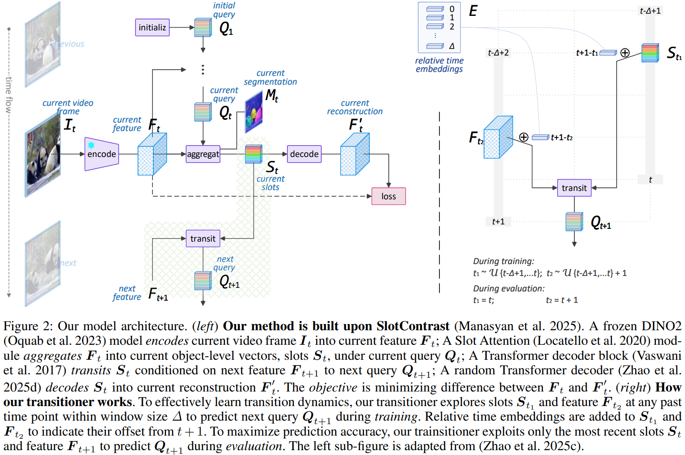
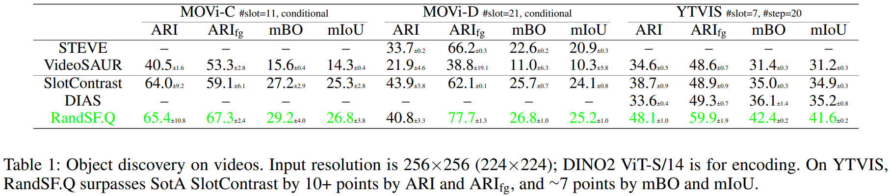
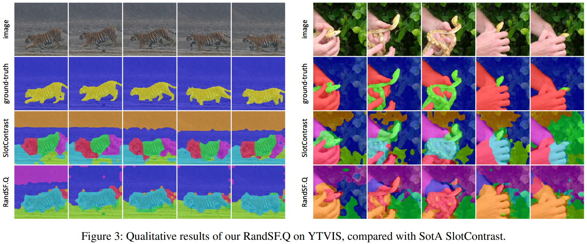

# RandSF.Q : Predicting Video Slot Attention Queries from Random Slot-Feature Pairs


[](https://arxiv.org/abs/2508.01345)
[](LICENSE)
[](https://www.python.org)
[](https://pytorch.org)
[](https://github.com/Genera1Z/RandSF.Q?tab=readme-ov-file#-model-checkpoints--training-logs)
[](https://github.com/Genera1Z/RandSF.Q?tab=readme-ov-file#-model-checkpoints--training-logs)


Unsupervised video Object-Centric Learning (OCL) is promising as it enables object-level scene representation and dynamics modeling as we humans do. Mainstream video OCL methods adopt a recurrent architecture: An aggregator aggregates current video frame into object features, termed slots, under some queries; A transitioner transits current slots to queries for the next frame. This is an effective architecture but all existing implementations both (\textit{i1}) neglect to incorporate next frame features, the most informative source for query prediction, and (\textit{i2}) fail to learn transition dynamics, the knowledge essential for query prediction. To address these issues, we propose Random Slot-Feature pair for learning Query prediction (RandSF.Q): (\textit{t1}) We design a new transitioner to incorporate both slots and features, which provides more information for query prediction; (\textit{t2}) We train the transitioner to predict queries from slot-feature pairs randomly sampled from available recurrences, which drives it to learn transition dynamics. Experiments on scene representation demonstrate that our method surpass existing video OCL methods significantly, e.g., **up to 10 points** on object discovery, setting new state-of-the-art. Such superiority also benefits downstream tasks like dynamics modeling.


<!-- ## 🎉 Accepted to ACM MM 2025 as a Poster -->

Official source code, model checkpoints and training logs for paper "**Predicting Video Slot Attention Queries from Random Slot-Feature Pairs**".

**Our model achitecture**:



## 🏆 Performance

### (1) ⭐⭐⭐ Re-evaluated Performance Values @ Version 3 ⭐⭐⭐

Object discovery:

|                       |    ari    |   arifg   |    mbo   |   miou   |
|-----------------------|:---------:|:---------:|:--------:|:--------:|
| randsfq_c-movi_c      | 65.4±10.7 |  67.4±2.1 | 29.2±3.8 | 26.8±3.7 |
| randsfq_c-movi_d      |  41.6±3.7 |  77.5±1.0 | 27.4±1.0 | 25.6±1.0 |
| randsfq_r-ytvis       |  41.5±0.1 |  58.9±0.9 | 39.4±0.4 | 39.0±0.4 |
| randsfq_c-movi_c-tsim |  64.0±2.9 |  66.3±1.7 | 28.4±1.3 | 26.1±1.1 |
| randsfq_c-movi_d-tsim |  41.2±2.2 |  72.0±1.1 | 27.1±0.9 | 25.4±0.9 |
| randsfq_r-ytvis-tsim  |  46.8±0.7 |  60.7±1.7 | 41.5±0.2 | 40.6±0.1 |
| slotcontrast_c-movi_c |  64.6±9.4 |  59.9±5.3 | 27.7±3.0 | 25.8±2.9 |
| slotcontrast_c-movi_d |  45.3±4.1 |  63.9±0.2 | 26.7±1.0 | 25.1±1.0 |
| slotcontrast_r-ytvis  |  38.1±0.7 |  48.8±1.5 | 34.5±0.3 | 34.4±0.2 |
| videosaur_c-movi_c    |  41.9±1.1 |  53.3±2.1 | 16.1±0.4 | 14.8±0.4 |
| videosaur_c-movi_d    |  22.5±5.0 | 40.0±20.1 | 11.6±6.6 | 10.8±6.1 |
| videosaur_r-ytvis     |  34.4±0.6 |  48.9±0.6 | 31.1±0.3 | 30.9±0.3 |

Object recognition:
|                             | class top1 | class top3 | bbox iou | matched num |
|----------------------------:|:----------:|:----------:|:--------:|:-----------:|
|      randsfq_r_recogn-ytvis |  28.0±0.9  |  64.1±2.5  | 55.5±0.6 |   7601±149  |
| slotcontrast_r_recogn-ytvis |  19.2±1.6  |  50.9±3.2  | 53.9±0.1 |   9155±363  |


### (2) Old Performance Values

**Object discovery accuracy**:


**Object discovery visualization**:



## 🌟 Highlights

⭐⭐⭐ ***Inherited from GitHub repo [VQ-VFM-OCL](https://github.com/Genera1Z/VQ-VFM-OCL).*** ⭐⭐⭐

- ✅ **fp16 fast training** [Automatic mixed precision](https://docs.pytorch.org/tutorials/recipes/recipes/amp_recipe.html) training (fp32+fp16) is enabled. Most of the training can be finished less than 4 or 8 hours (for image or video OCL respectively) using one V100 GPU.
- ✅ **less I/O overhead** Datasets are stored in [LMBD](https://lmdb.readthedocs.io) database format to save I/O overhead, beneficial especially on computing cluster.

- ✅ **config-driven experiment** This is totally config-driven framework, largely inspired by [OpenMMLab](https://github.com/open-mmlab), but with much less capsulation.

- ✅ **strong baselines** <!-- All models requiring VAE are implemented with StableDiffusion pretrained VAE [TinyVAE](https://huggingface.co/docs/diffusers/v0.30.1/en/api/models/autoencoder_tiny); --> All models are trained with [strong](https://arxiv.org/abs/2206.07764) data augmentations; All models employ vision foundation model [DINO2](https://huggingface.co/docs/transformers/en/model_doc/dinov2) as their backbone.


## 🚑️ Changelogs

- ⭐⭐⭐ [2025/10/21] ⭐⭐⭐ **Object discovery accuracy values are updated for version 3. Check this table file [acc-v3.xlsx](acc-v3.xlsx) for details**.
- [2025/10/20] Version 3 (based on [VQ-VFM-OCL](https://github.com/Genera1Z/VQ-VFM-OCL)): re-implement segmentation evaluation; corresponding new dataset lmdb files are uploaded. Thus, object discovery acc could change a little, especially ARI values.


## 🧭 Repo Stucture

[Source code](https://github.com/Genera1Z/RandSF.Q).
```shell
- config-randsfq/       # *** configs for our RandSF.Q ***
- config-randsfq-tsim/  # *** with time similarity loss ***
- config-slotcontrast/  # configs for SlotContrast
- config-videosaur/     # configs for VideoSAUR
- object_centric_bench/
  - datum/              # dataset loading and preprocessing
  - model/              # model building
    - ...
    - randsfq.py        # *** for our RandSF.Q model building ***
    - ...
  - learn/              # metrics, optimizers and callbacks
- convert.py
- train.py
- eval.py
- requirements.txt
```

[Releases](https://github.com/Genera1Z/RandSF.Q/releases).
```shell
- dataset-movi_c/       # dataset files in LMDB format
- dataset-ytvis/
- archive-randsfq/      # *** our RandSF.Q models and logs ***
- archive-randsfq-tsim/
- archive-slotcontrast/ # baseline model checkpoints and training logs
- archive-videosaur/
- archive-recogn/       # object recognition models based on RandSF.Q and SlotContrast
```


## 🚀 Converted Datasets

Converted datasets, including MOVi-C, MOVi-D and YTVIS are available as [releases](https://github.com/Genera1Z/RandSF.Q/releases).
- [dataset-movi_c](https://github.com/Genera1Z/RandSF.Q/releases/tag/dataset-movi_c): converted dataset [MOVi-C](https://github.com/google-research/kubric/blob/main/challenges/movi).
- [dataset-movi_d](https://github.com/Genera1Z/VQ-VFM-OCL/releases/tag/dataset-movi_d): converted dataset [MOVi-D](https://github.com/google-research/kubric/blob/main/challenges/movi).
- [dataset-ytvis](https://github.com/Genera1Z/RandSF.Q/releases/tag/dataset-ytvis): converted dataset [YTVIS](https://youtube-vos.org/dataset/vis), the [high-quality](https://github.com/SysCV/vmt?tab=readme-ov-file#hq-ytvis-high-quality-video-instance-segmentation-dataset) version.


## 🧠 Model Checkpoints & Training Logs

**The checkpoints and training logs (@ random seeds 42, 43 and 44) for all models** are available as [releases](https://github.com/Genera1Z/RandSF.Q/releases). All backbones are unified as DINO2-S/14.
- [archive-videosaur](https://github.com/Genera1Z/RandSF.Q/releases/tag/archive-videosaur): VideoSAUR on MOVi-C/D and YTVIS.
    - My implementation of paper **Object-Centric Learning for Real-World Videos by Predicting Temporal Feature Similarities**, NeurIPS 2023.
- [archive-slotcontrast](https://github.com/Genera1Z/RandSF.Q/releases/tag/archive-slotcontrast): SlotContrast on MOVi-C/D and YTVIS.
    - My implementation of paper **Temporally Consistent Object-Centric Learning by Contrasting Slots**, CVPR 2025 Oral.
- [archive-randsfq](https://github.com/Genera1Z/RandSF.Q/releases/tag/archive-randsfq): RandSF.Q on MOVi-C/D and YTVIS.
    - Our proposed method RandSF.Q, which is built upon SlotContrast.
- [archive-randsfq-tsim](https://github.com/Genera1Z/RandSF.Q/releases/tag/archive-randsfq-tsim): RandSF.Q, with time similarity loss, on MOVi-C/D and YTVIS.
    - Our proposed method RandSF.Q, which is built upon SlotContrast but using time similarity loss.
- [archive-recogn](https://github.com/Genera1Z/RandSF.Q/releases/tag/archive-recogn): Object recognition models based on pretrained RandSF.Q-tsim and SlotContrast, on YTVIS.
    - Slots extracted by RandSF.Q or SlotContrast are matched ground-truth object segmentations by threshold 1e-1@IoU, and are used to train category classification and bounding box regression.


## 🔥 How to Use


### (1) Install

(Using Python version 3.11)
```shell
pip install -r requirements.txt
```
Use package versions no older than the specification.


### (2) Prepare

Download **converted datasets** or convert original datasets into LMDB format: 
```shell
python convert.py
```
But **firstly** download original datasets according to docs of ```XxxDataset.convert_dataset()```.


### (3) Train

Run training:
```shell
python train.py
```
But **firstly** change the arguments marked with ```TODO XXX``` to your needs.

For example,
```shell
python train.py \
    --seed 42 \
    --cfg_file config-randsfq/randsfq_r-ytvis.py \
    --data_dir path/to/ytvis
```


### (4) Evaluate

Run evaluation:
```shell
python eval.py
```
But **firstly** modify places marked with ``TODO XXX`` according to your needs.


## 💡 Tips

1. Any config file can be converted into typical Python code by changing from
```Python
model = dict(type=ClassName, key1=value1,..)
```
to
```Python
model = ClassName(key1=value1,..)
```

2. All config files follow a similar structure, and you can use file comparator [Meld](https://meldmerge.org) with [VSCode](https://code.visualstudio.com/) plugin [Meld Diff](https://marketplace.visualstudio.com/items?itemName=danielroedl.meld-diff) to check their differences.


## 🤗 Contact & Support

I am now working on Object-Centric Learning (OCL). If you have any cool ideas or issues, do not hasitate to contact me!
- WeChat: Genera1Z
- GoogleScholar: [MqlwrKAAAAAJ](https://scholar.google.com/citations?hl=en&user=MqlwrKAAAAAJ&view_op=list_works&sortby=pubdate)
- LinkedIn: [rongzhen-zhao-3b7215247](https://www.linkedin.com/in/rongzhen-zhao-3b7215247)
- eMail: rongzhen.zhao@aalto.fi, zhaorongzhenagi@gmail.com

If you are applying OCL (not limited to this repo) to tasks like **visual question answering**, **visual prediction/reasoning**, **world modeling** and **reinforcement learning**, let us collaborate!


## ⚗️ Further Research

My further research works on OCL can be found in [my repos](https://github.com/Genera1Z?tab=repositories).


## 📚 Citation

If you find this repo useful, please cite our work.
```
@article{zhao2025randsfq,
  title={{Predicting Video Slot Attention Queries from Random Slot-Feature Pairs}},
  author={Zhao, Rongzhen and Li, Jian and Kannala, Juho and Pajarinen, Joni},
  journal={arXiv:2508.01345},
  year={2025}
}
```
