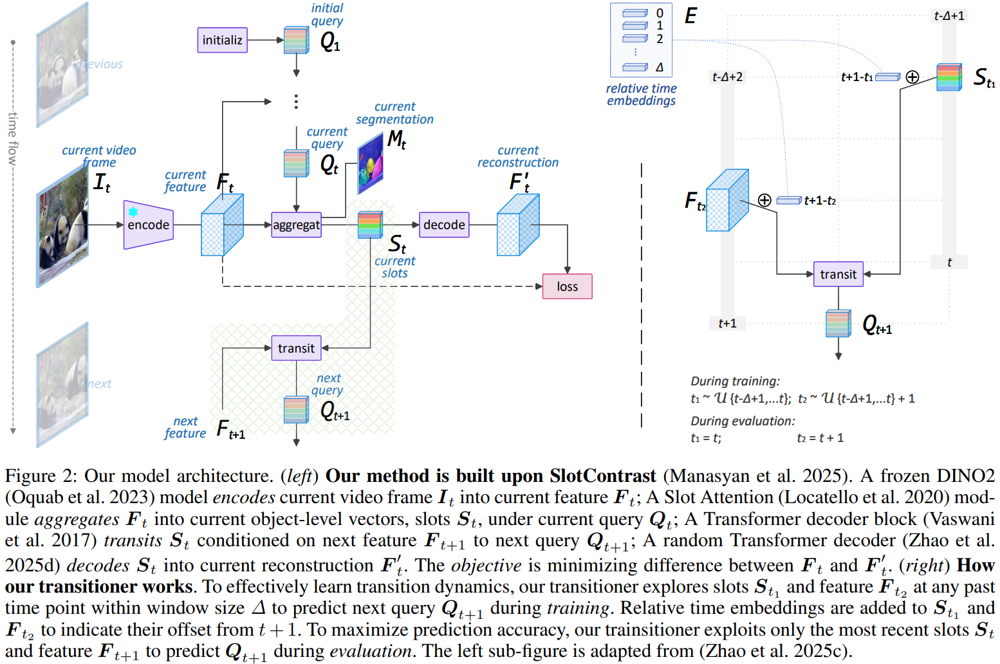
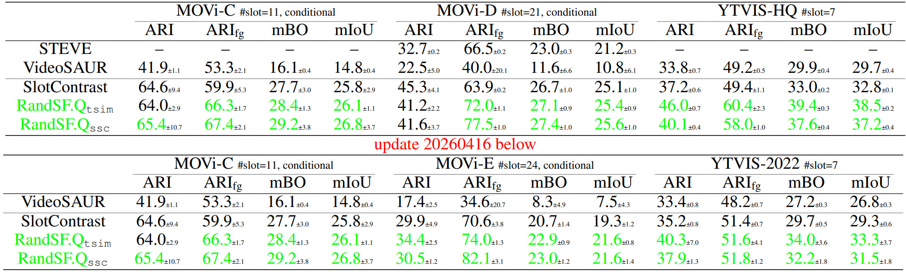
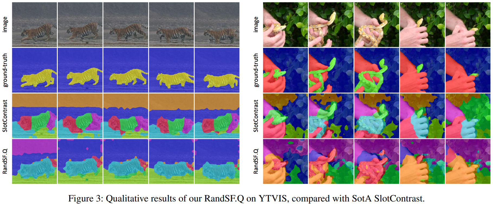
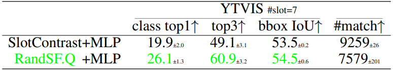

# `RandSF.Q` Predicting Video Slot Attention Queries from Random Slot-Feature Pairs


[](https://arxiv.org/abs/2508.01345)
[](LICENSE)
[](https://www.python.org)
[](https://pytorch.org)
[](https://github.com/Genera1Z/RandSF.Q?tab=readme-ov-file#-model-checkpoints--training-logs)
[](https://github.com/Genera1Z/RandSF.Q?tab=readme-ov-file#-model-checkpoints--training-logs)


Unsupervised video Object-Centric Learning (OCL) is promising as it enables object-level scene representation and dynamics modeling as we humans do. Mainstream video OCL methods adopt a recurrent architecture: An aggregator aggregates current video frame into object features, termed slots, under some queries; A transitioner transits current slots to queries for the next frame. This is an effective architecture but all existing implementations both (\textit{i1}) neglect to incorporate next frame features, the most informative source for query prediction, and (\textit{i2}) fail to learn transition dynamics, the knowledge essential for query prediction. To address these issues, we propose Random Slot-Feature pair for learning Query prediction (RandSF.Q): (\textit{t1}) We design a new transitioner to incorporate both slots and features, which provides more information for query prediction; (\textit{t2}) We train the transitioner to predict queries from slot-feature pairs randomly sampled from available recurrences, which drives it to learn transition dynamics. Experiments on scene representation demonstrate that our method surpass existing video OCL methods significantly, e.g., **up to 10 points** on object discovery, setting new state-of-the-art. Such superiority also benefits downstream tasks like dynamics modeling.


## 🎉 Accepted to AAAI 2026 as a Poster

Official source code, model checkpoints and training logs for paper "**Predicting Video Slot Attention Queries from Random Slot-Feature Pairs**".

**Our model achitecture**:



## 🏆 Performance

**Object discovery accuracy**:



**Object discovery visualization**:



**Object recognition accuracy**:




## 🌟 Highlights

⭐⭐⭐ ***Please check GitHub repo [VQ-VFM-OCL](https://github.com/Genera1Z/VQ-VFM-OCL).*** ⭐⭐⭐


## 🧭 Repo Stucture

[Source code](https://github.com/Genera1Z/RandSF.Q).
```shell
- config-randsfq/       # *** configs for our RandSF.Q ***
- config-randsfq-tsim/  # *** with time similarity loss ***
- config-slotcontrast/  # configs for SlotContrast
- config-videosaur/     # configs for VideoSAUR
- object_centric_bench/
  - datum/              # dataset loading and preprocessing
  - model/              # model building
    - ...
    - randsfq.py        # *** for our RandSF.Q model building ***
    - ...
  - learn/              # metrics, optimizers and callbacks
- train.py
- eval.py
- requirements.txt
```

[Releases](https://github.com/Genera1Z/RandSF.Q/releases).
```shell
- dataset-movi_c/       # dataset files in LMDB format
- dataset-ytvis/
- archive-randsfq/      # *** our RandSF.Q models and logs ***
- archive-randsfq-tsim/
- archive-slotcontrast/ # baseline model checkpoints and training logs
- archive-videosaur/
- archive-recogn/       # object recognition models based on RandSF.Q and SlotContrast
```


## 🚀 Converted Datasets

Datasets MOVi-C, MOVi-D and YTVIS, which are converted into LMDB format and can be used off-the-shelf, are available as [releases](https://github.com/Genera1Z/RandSF.Q/releases).
- [dataset-movi_c](https://github.com/Genera1Z/RandSF.Q/releases/tag/dataset-movi_c): converted dataset [MOVi-C](https://github.com/google-research/kubric/blob/main/challenges/movi).
- [dataset-movi_d](https://github.com/Genera1Z/VQ-VFM-OCL/releases/tag/dataset-movi_d): converted dataset [MOVi-D](https://github.com/google-research/kubric/blob/main/challenges/movi).
- [dataset-ytvis](https://github.com/Genera1Z/RandSF.Q/releases/tag/dataset-ytvis): converted dataset [YTVIS](https://youtube-vos.org/dataset/vis), the [high-quality](https://github.com/SysCV/vmt?tab=readme-ov-file#hq-ytvis-high-quality-video-instance-segmentation-dataset) version.


## 🧠 Model Checkpoints & Training Logs

**The checkpoints and training logs (@ random seeds 42, 43 and 44) for all models** are available as [releases](https://github.com/Genera1Z/RandSF.Q/releases). All backbones are unified as DINO2-S/14.
- [archive-videosaur](https://github.com/Genera1Z/RandSF.Q/releases/tag/archive-videosaur): VideoSAUR on MOVi-C/D and YTVIS.
    - My implementation of paper **Object-Centric Learning for Real-World Videos by Predicting Temporal Feature Similarities**, NeurIPS 2023.
- [archive-slotcontrast](https://github.com/Genera1Z/RandSF.Q/releases/tag/archive-slotcontrast): SlotContrast on MOVi-C/D and YTVIS.
    - My implementation of paper **Temporally Consistent Object-Centric Learning by Contrasting Slots**, CVPR 2025 Oral.
- [archive-randsfq](https://github.com/Genera1Z/RandSF.Q/releases/tag/archive-randsfq): RandSF.Q on MOVi-C/D and YTVIS.
    - Our proposed method RandSF.Q, which is built upon SlotContrast.
- [archive-randsfq-tsim](https://github.com/Genera1Z/RandSF.Q/releases/tag/archive-randsfq-tsim): RandSF.Q, with time similarity loss, on MOVi-C/D and YTVIS.
    - Our proposed method RandSF.Q, which is built upon SlotContrast but using time similarity loss.
- [slatesteve](https://github.com/Genera1Z/VQ-VFM-OCL/releases/tag/slatesteve): STEVE on MOVi-D.
    - My implementation of paper **Simple Unsupervised Object-Centric Learning for Complex and Naturalistic Videos**, NeurIPS 2022, achieving much better performance.
- [archive-recogn](https://github.com/Genera1Z/RandSF.Q/releases/tag/archive-recogn): Object recognition models based on pretrained RandSF.Q-tsim and SlotContrast, on YTVIS.
    - Slots extracted by RandSF.Q or SlotContrast are matched with ground-truth object segmentations by threshold 1e-1@IoU, and the matched slots are used to train category classification and bounding box regression


## 🔥 How to Use

Take RandSF.Q on COCO as an example.

**(1) Environment**

To set up the environment, run:
```shell
# python 3.11
pip install -r requirements.txt
```

**(2) Dataset**

To prepare the dataset, download ***Converted Datasets*** and unzip to `path/to/your/dataset/`. Or convert them by yourself according to ```XxxDataset.convert_dataset()``` docs.

**(3) Train**

To train the model, run:
```shell
python train.py \
    --seed 42 \
    --cfg_file config-randsfq/randsfq_r-ytvis.py \
    --data_dir path/to/your/dataset \
    --save_dir save
```

**(4) Evaluate**

To evaluate the model, run:
```shell
python eval.py \
    --cfg_file config-randsfq/randsfq_r-ytvis.py \
    --data_dir path/to/your/dataset \
    --ckpt_file archive-randsfq/randsfq_r-ytvis/best.pth \
    --is_viz True \
    --is_img False
# object discovery accuracy values will be printed in the terminal
# object discovery visualization will be saved to ./randsfq_r-ytvis/
```


## 🤗 Contact & Support

If you have any issues on this repo or cool ideas on OCL, please do not hesitate to contact me!
- page: https://genera1z.github.io
- email: rongzhen.zhao@aalto.fi, zhaorongzhenagi@gmail.com

If you are applying OCL (not limited to this repo) to tasks like **visual question answering**, **visual prediction/reasoning**, **world modeling** and **reinforcement learning**, let us collaborate!


## ⚗️ Further Research

My further research works on OCL can be found in [my repos](https://github.com/Genera1Z?tab=repositories) or [my academic page](https://genera1z.github.io).


## 📚 Citation

If you find this repo useful, please cite our work.
```
@article{zhao2025randsfq,
  title={{Predicting Video Slot Attention Queries from Random Slot-Feature Pairs}},
  author={Zhao, Rongzhen and Li, Jian and Kannala, Juho and Pajarinen, Joni},
  journal={AAAI},
  year={2026}
}
```
